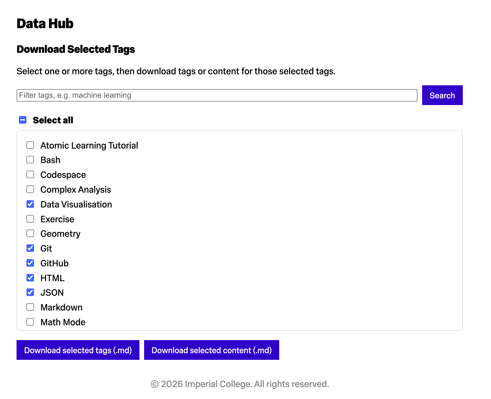

# Content Ingester

Content Ingester turns teaching material into Atomic Learning pages. It helps an editor propose page structure, generate content in dependency order, check the result, and publish each page to its own GitHub repository.

The workflow is agent-assisted, with required human approval at each checkpoint.

## Contents

- [How it works](#how-it-works)
- [Quick start](#quick-start)
- [Set up the environment](#set-up-the-environment)
- [Prepare the inputs](#prepare-the-inputs)
- [Run the workflow](#run-the-workflow)
- [Validate workflow changes](#validation-workflow-prompt)
- [Final checklist](#final-checklist)

## How it works

| Stage    | Action                                                     | Main output                                                       |
| -------- | ---------------------------------------------------------- | ----------------------------------------------------------------- |
| Prepare  | Add source material and current website exports            | Files under `inputs/`                                             |
| Propose  | Split the material into atomic pages and map prerequisites | `proposed_structure.json` and `dependency_graph.md`               |
| Generate | Create one page at a time in dependency order              | Page folders containing content, metadata, licence, and resources |
| Check    | Validate files, links, tags, and dependencies              | Updated graph and related-content recommendations                 |
| Publish  | Upload and verify one page at a time                       | GitHub repositories and `upload_summary.txt`                      |

## Quick start

1. Complete either the [Codespaces setup](#github-codespaces) or [local setup](#local-setup).
2. Configure [GitHub access](#github-access) and optional [authors](#authors).
3. Download current content and tags from the [Atomic Learning data hub](http://atomic.dept.ic.ac.uk/data).
4. Add the exports and new teaching material using the [input layout](#input-layout).
5. Ask the agent to begin [Checkpoint 1](#checkpoint-1-propose-the-structure).
6. Review and approve each checkpoint before continuing.

## Set up the environment

Use this repository in Visual Studio Code with GitHub Copilot, either in GitHub Codespaces or on your local machine.

### GitHub Codespaces

The repository includes a development container configuration in `.devcontainer/`.

1. Open the repository on GitHub.
2. Select **Code** -> **Codespaces** -> **Create codespace on main**, or choose your working branch.
3. Wait for the container build and `postCreateCommand` to finish.

The container creates `.venv` and installs the Python dependencies automatically.

### Local setup

Python 3.12 or higher is required. Create and activate a virtual environment, then install dependencies. The agent will attempt
to perform the local setup automatically if a venv is not detected.

macOS or Linux:

```bash
python3 -m venv .venv
. .venv/bin/activate
python -m pip install -r requirements.txt
```

Windows PowerShell:

```powershell
python -m venv .venv
.\.venv\Scripts\Activate.ps1
python -m pip install -r requirements.txt
```

Linux/macOS (bash):

```bash
python3 -m venv venv
source venv/bin/activate
pip install -r requirements.txt
```

### GitHub API access

A GitHub Personal Access Token (PAT) with repo permissions is required to publish content.
Add your token to a `.env` file `GITHUB_PAT=your_github_pat_here`.

### Author configuration

To automatically set author names in generated metadata files, create `inputs/authors.md` with one author identifier per line, for example:

```
jane-doe
joe-bloggs
```

Author identifiers must be lowercase and hyphen-separated (e.g., `jane-smith`, `john-doe`). This is optional — if not configured, the `set-authors` skill will skip with an informative error message. See `.github/skills/set-authors/SKILL.md` for details.

## Prepare the inputs

### Working directories

The agent reads these optional values from `.env` at the start of a run:

| Variable                       | Default   | Purpose                                           |
| ------------------------------ | --------- | ------------------------------------------------- |
| `CONTENT_INGESTER_INPUTS_DIR`  | `inputs`  | Source material and live website exports          |
| `CONTENT_INGESTER_OUTPUTS_DIR` | `outputs` | Proposed structures, generated pages, and reports |

Paths may be relative to the repository root or absolute.

### Input layout

1. Navigate to the [Atomic Learning data hub](http://atomic.dept.ic.ac.uk/data)
   
2. Using the checkboxes select tags that are related to the content you want to ingest.
3. Download thge selected tags and content using the buttons at the bottom of the page.
4. Once downloaded arrange the files as follows:

```text
inputs/
|-- authors.md                         # Optional
|-- content-to-ingest/
|   `-- <new teaching material>
|-- human-inputs/                      # Optional notes or images
`-- live-website-export/
    |-- <current content export>.md
    `-- <current tags export>.md
```

The current content export should include existing page slugs and, where available, descriptions, prerequisites, and related links. It prevents duplicate proposals and provides known prerequisite references.

The tags export should list current platform tags. The agent reuses these tags and proposes new ones only when necessary.

### Supported source files

Place new source material in `<input-dir>/content-to-ingest/`.

| Format                      | Preparation                                                          |
| --------------------------- | -------------------------------------------------------------------- |
| Markdown (`.md`)            | No extraction required                                               |
| Jupyter Notebook (`.ipynb`) | No extraction required                                               |
| PDF (`.pdf`)                | The agent runs `tools/extract_pdf_assets.py` before proposing pages  |
| PowerPoint (`.pptx`)        | The agent runs `tools/extract_pptx_assets.py` before proposing pages |

PDF artifacts are written to `<output-dir>/pdf-processing/`. PowerPoint artifacts are written to `<output-dir>/pptx-processing/`. See the [PDF extraction instructions](.github/instructions/pdf-data-extraction.md) and [PowerPoint extraction instructions](.github/instructions/pptx-data-extraction.md) for details.

Before proposing pages, the agent also ensures that the shared [content template](https://github.com/Atomic-Learning/content-template) is available under `templates/`.

## Run the workflow

Complete the checkpoints in order. Do not continue past a checkpoint until its outputs have been reviewed and approved.

### Checkpoint 1: Structure proposal

Prompt the agent to create the proposed structure from the input files, for example:

`Create <output-dir>/proposed_structure.json from <input-dir>/, then generate <output-dir>/dependency_graph.md and summarise key risks.`

Review before approval:

1. `<output-dir>/proposed_structure.json` has required keys and complete page entries.
2. Page slugs and prerequisites make sense for your curriculum.
3. status is used correctly (new vs missing prerequisites).
4. `<output-dir>/dependency_graph.md` has no obvious circular dependencies.
5. Proposed tags align with current tags, with any new tags clearly justified.

### Checkpoint 2: Page generation

Prompt the agent to generate the next page folder and content, for example:

`Using approved <output-dir>/proposed_structure.json, generate the next page at <output-dir>/<slug>/ with all required files.`

Repeat this for each page. The agent will determine the next page based on which pages in proposed_structure.json do not yet have a folder in the configured output directory. You can delete a page folder and revisit it, or ask the agent to skip a page and return to it later.

If `inputs/authors.md` is present, author names will be automatically applied to all generated metadata files during this stage.

Review each page for quality:

1. Each page folder contains all required files.
2. metadata.json slug matches folder name.
3. content.html follows house rules (no h1, UK English, clean HTML).
4. Prerequisites and related content are plausible and consistent.
5. Spot-check 3 to 5 pages for quality and scope (single learning objective).

### Checkpoint 3: Consistency and recommendations

Prompt the agent to run a consistency pass and generate recommendations, for example:

`Run a full consistency pass on <output-dir>/, fix metadata/linking issues, regenerate dependency_graph.md, and create related_content_recommendations.md.`

Review before approval:

1. Final graph still has no circular dependencies.
2. No broken or unknown prerequisite slugs remain.
3. `related_content_recommendations.md` is specific and actionable.

### Checkpoint 4: Publish

Prompt the agent to run the publish workflow for one page at a time, for example:

`Run Stage 5 (upload-and-check) for <output-dir>/<slug>/.`

Review before approving each page:

1. The correct repository was created on GitHub.
2. `<output-dir>/upload_summary.txt` has been updated to reflect all uploads so far.
3. The page appears correctly on the live site.
4. Prerequisites and related content resolve to valid pages on the site.

Once all pages have been published, prompt the agent to generate the final upload summary:

`Write <output-dir>/upload_summary.txt with created, skipped, and failed repositories.`

### Validation workflow prompt

Use the Workflow Validation Assistant for regression checks.

Prompt:

`Run validate-workflow for all cases in workflow-validation/.`

## Minimal Checklist

1. Approve proposed_structure.json and dependency_graph.md.
2. Approve generated page files and metadata quality.
3. Approve final consistency pass and recommendations.
4. Approve publish results and final upload summary.
