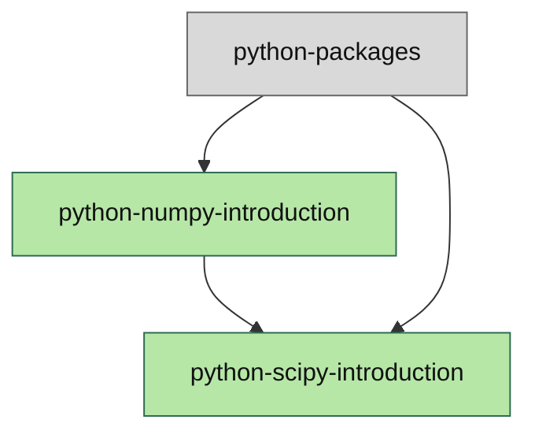

# Dependency Graph

Generated from mode: proposed.

## Legend

- Green: new page in this proposal or content batch
- Grey: existing page already present in platform content
- Yellow: proposed missing prerequisite not yet in platform
- Red: referenced slug not identified as existing or proposed missing

